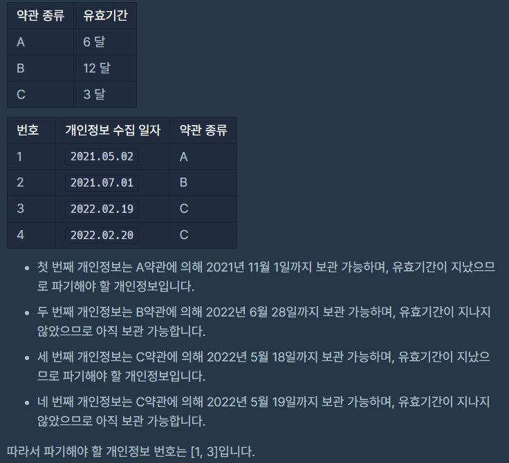

고객의 약관 동의를 얻어서 수집된 1~n번으로 분류되는 개인정보 n개가 있습니다.  약관 종류는 여러 가지 있으며 각 약관마다 개인정보 보관 유효기간이 정해져 있습니다.  당신은 각 개인정보가 어떤 약관으로 수집됐는지 알고 있습니다. 수집된 개인정보는 유효기간 전까지만 보관 가능하며,  유효기간이 지났다면 반드시 파기해야 합니다.

예를 들어, A라는 약관의 유효기간이 12 달이고,  2021년 1월 5일에 수집된 개인정보가 A약관으로 수집되었다면 해당 개인정보는 2022년 1월 4일까지 보관 가능하며  2022년 1월 5일부터 파기해야 할 개인정보입니다.
당신은 오늘 날짜로 파기해야 할 개인정보 번호들을 구하려 합니다.

모든 달은 28일까지 있다고 가정합니다.

다음은 오늘 날짜가 2022.05.19일 때의 예시입니다. 

오늘 날짜를 의미하는 문자열 today,  약관의 유효기간을 담은 1차원 문자열 배열 terms와  수집된 개인정보의 정보를 담은 1차원 문자열 배열 privacies가 매개변수로 주어집니다.  이때 파기해야 할 개인정보의 번호를 오름차순으로 1차원 정수 배열에 담아 return 하도록 solution 함수를 완성해 주세요.