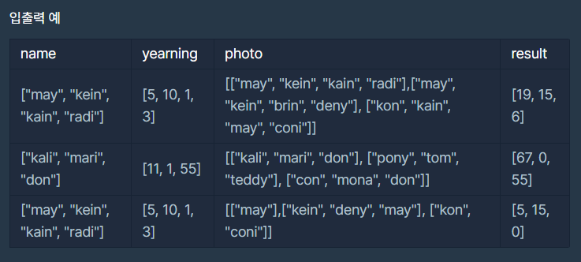

- 해당 사진의 추억 점수 = 사진 속에 나오는 인물의 그리움 점수를 모두 합산한 값 

- 예를 들어, 사진 속 인물의 이름이 ["may", "kein", "kain"]이고 각 인물의 그리움 점수가 [5점, 10점, 1점]일 때 해당 사진의 추억 점수는 16(5 + 10 + 1)점이 됩니다. 

- 그리움 점수가 없는 사람의 추억 점수는 0점입니다.

- 그리워하는 사람의 이름을 담은 문자열 배열 name, 
- 각 사람별 그리움 점수를 담은 정수 배열 yearning, 
- 각 사진에 찍힌 인물의 이름을 담은 이차원 문자열 배열 photo가 매개변수로 주어질 때, 
###### 사진들의 추억 점수를 photo에 주어진 순서대로 배열에 담아 return하는 solution 함수를 완성해주세요.

